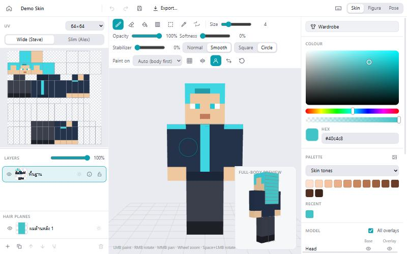
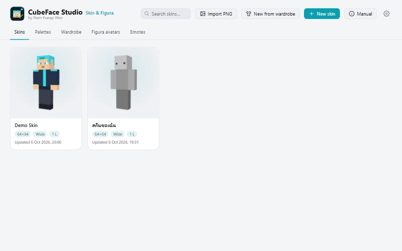
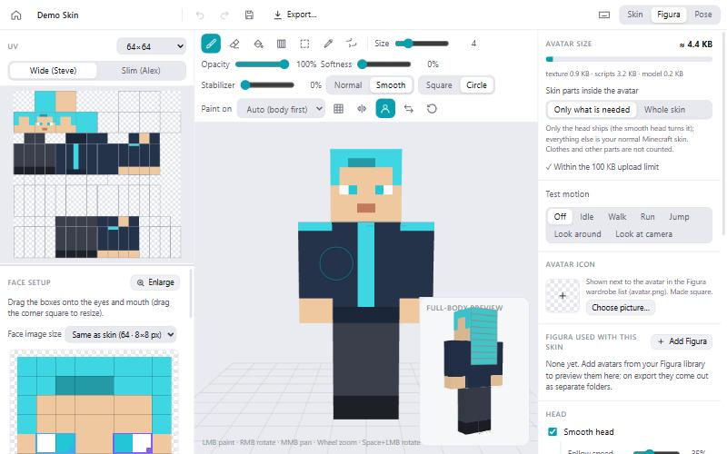
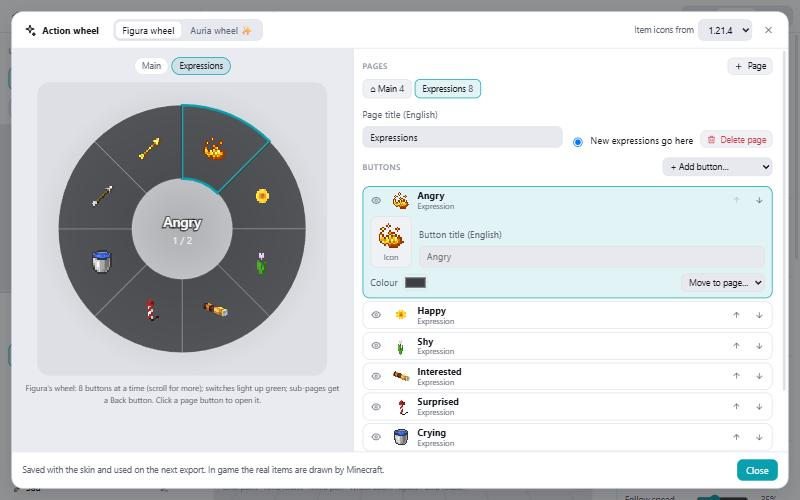
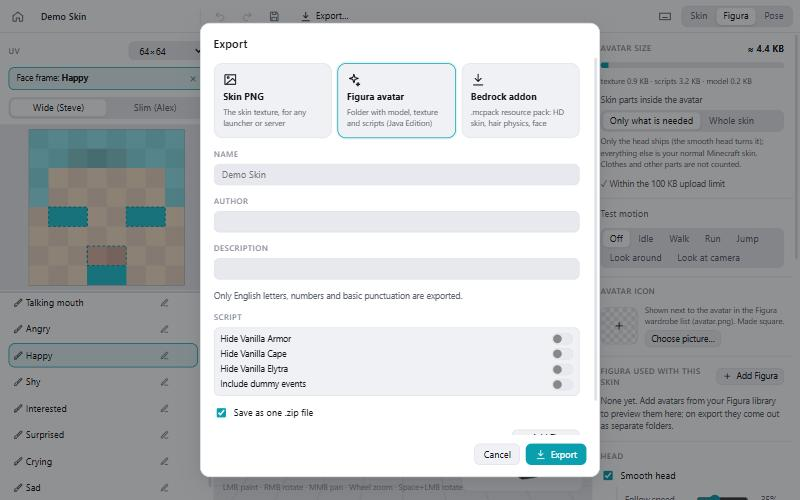

<p align="center">
  
</p>

<h1 align="center">CubeFace Studio</h1>

<p align="center">
  <b>A Minecraft skin editor that also builds Figura avatars.</b><br>
  by <b>Nam Kueap Wan</b> · <b>English</b> · <a href="README.th.md">ภาษาไทย</a>
</p>

> [!IMPORTANT]
> **This whole project was made 100% with AI.** Every line of code, the logo, the docs and
> the tests were written by an AI (Anthropic's Claude), directed by Nam Kueap Wan. It is
> shared as is: it works and is tested, but it may still have mistakes. See [LICENSE](LICENSE).

<p align="center">
  
</p>

## What is it?

CubeFace Studio is a desktop app (Windows, made with Electron) for making Minecraft skins and
turning them into **[Figura](https://figuramc.org)** avatars: a skin that moves its head
smoothly, has swinging hair, blinks, changes expressions, glows in the dark, and has an action
wheel to control it all in game. It works **offline**; nothing is uploaded anywhere.

The app is in **Thai and English** (switch any time in ⚙ Settings).

## Features

**Skin editor**
- Paint on the 3D model or the flat UV view; skins from 64×64 up to 2048×2048, wide or slim
  arms.
- Brush (Normal or Smooth blending), eraser, bucket, gradient, selection (copy / cut / move /
  paste), eyedropper (hold Alt), mirror painting, stabilizer, a ring that shows where the brush
  paints.
- Layers with opacity, lock, merge, and "glows in the dark" per layer.
- Palettes (also made from a picture), a wardrobe of clothes and parts, undo / redo.

**Figura avatar builder**
- Smooth head (also turns the head pieces of avatars merged into it), hair planes with
  physics, blinking, expressions and your own custom faces.
- Face frames from 16×16 to 128×128 px, drawn in a dedicated paint window; face sets you can
  reuse on other skins.
- Glow: eyes (paint exactly which spots glow), hair planes, layers, each with its own switch.
- Action wheel editor: Figura's wheel or the animated Auria wheel, pages, Back / Next / Home
  buttons, switches that can start on or off, item / picture / face icons.
- Export as a folder or one `.zip`; merge your library avatars into one avatar (renamed files
  and scripts are fixed so they keep working); Figura-wizard script options (hide vanilla
  armor, cape, elytra, dummy events); avatar icon.
- An upload-size meter that measures like Figura (checked against a real avatar: within
  0.1%).

**And more**
- Bedrock Edition `.mcpack` export.
- Pose mode: ready-made poses, your own poses, Emotecraft `.json` export, transparent PNG
  renders.
- Libraries for Figura avatars (folders, `.zip`, `.rar`) and emotes, with usage rights
  (free / bought / own / exclusive; commercial, redistribution, modification).

## Screenshots

| | |
| --- | --- |
|  |  |
|  |  |

## How to use it

The **[user manual](docs/manual.en.md)** explains everything step by step, with pictures
([คู่มือภาษาไทย](docs/manual.th.md)). In the app, the **Manual** button on the home screen
opens it.

In short:
1. **New skin** or **Import PNG** on the home screen.
2. Paint it. Add hair planes in the Skin tab.
3. In the **Figura** tab, place the eye and mouth boxes, press **Generate face frames**, and
   set up the head, hair, blinking and the action wheel.
4. **Export… → Figura avatar**, then put the folder or `.zip` into
   `.minecraft/figura/avatars/` and choose it in Figura's wardrobe.

## Download

Get the latest version from **[Releases](https://github.com/Maskbuild/Nkw-Custom-Skin/releases/latest)** (Windows 10/11, 64-bit):

- **CubeFace-Studio-Setup-1.0.1.exe**: installer (choose the folder, adds Start menu and desktop shortcuts).
- **CubeFace-Studio-1.0.1-win-x64-portable.zip**: no install; unzip anywhere and run `CubeFace Studio.exe`.

The app is not code-signed, so Windows SmartScreen may warn the first time: click *More info → Run anyway*.

## Build from source

You need **[Node.js](https://nodejs.org) 22 LTS or newer** and **Git**.

```bash
git clone https://github.com/Maskbuild/Nkw-Custom-Skin.git
cd Nkw-Custom-Skin
npm install
```

| Command | What it does |
| --- | --- |
| `npm run dev` | Start the app in development mode. |
| `npm run build` | Build the app into `out/`. |
| `npm run dist` | Build a Windows installer into `dist/`. |
| `npm test` | Run all tests (vitest). |
| `npm run typecheck` | Check the TypeScript types. |
| `npm run dev:web` | Run the editor in a browser (no file access; for quick UI work). |
| `npm run logo` | Redraw the logo / app icon files from `scripts/make-logo.cjs`. |

Your skins and libraries are saved in `%APPDATA%\nkw-skin-figura`.

## How it is built

- **Electron** + **React** + **TypeScript**, bundled with **electron-vite**; 3D with **three.js**;
  state with **zustand**; translations with **i18next**.
- `src/main`: the desktop side (files, avatar library, zip / rar import, export).
- `src/preload`: the bridge between the window and the desktop side.
- `src/renderer/src`: the app itself.
  - `skin/`: the skin document, layers, pixels, hair, Figura settings.
  - `figura/`: builds the Figura avatar (Blockbench model, `script.lua`, texture atlas, size).
  - `bedrock/`, `pose/`: Bedrock pack and pose / emote export.
  - `ui/`, `three/`, `i18n/`: screens, 3D view, Thai and English text.
- `src/figura/`: Lua shipped inside exported avatars (hair physics, the Auria wheel).
- `tests/`: unit tests, plus a runtime test that runs exported avatar scripts in a real Lua
  VM against a stand-in Figura API (`tests/lua/figura_mock.lua`), pressing every wheel button
  across many setting combinations.
- `docs/`: the manuals and their pictures. `build/`: app icons.

## Third-party

| Part | License |
| --- | --- |
| [Auria action wheel](https://github.com/lua-gods/auria-wheel) by AuriaFoxGirl (bundled in exported avatars, `src/figura/auria_wheel`; lightly modified: a right-click hint) | MIT |
| Electron, React, three.js, i18next, react-i18next, zustand, Vite, electron-vite, electron-builder, vitest | MIT |
| node-unrar-js (reads `.rar` files; includes the UnRAR library, which may not be used to re-create the RAR compression algorithm) | MIT + UnRAR license |
| luaparse, fengari (tests only) | MIT |
| TypeScript (build only) | Apache-2.0 |

Minecraft is a trademark of Mojang AB / Microsoft. Figura belongs to the FiguraMC team.
This project is not affiliated with either.

## License

**[CubeFace Studio License](LICENSE)**, in short:
- ✅ Use it, share it, change it, sell it, do anything with it, for free.
- 🙏 Please don't claim you made it yourself. If you changed it, that's up to you.
- 🙏 Please don't sue me: it comes as is, with no warranty, and was made by AI.

## Credits

- Idea, direction and testing: **Nam Kueap Wan**
- Code, logo, docs and tests: **AI (Anthropic's Claude)**, 100%
