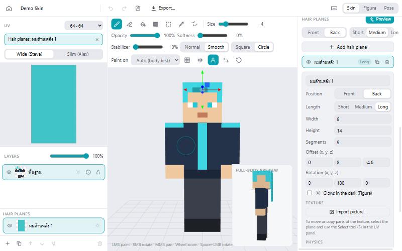
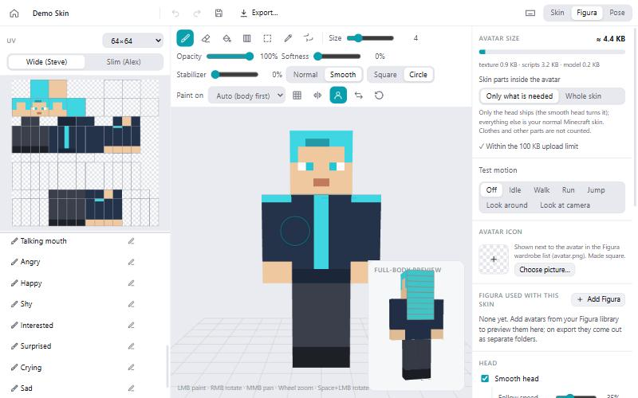
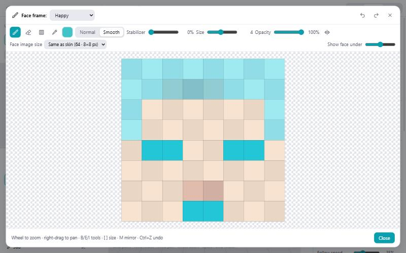
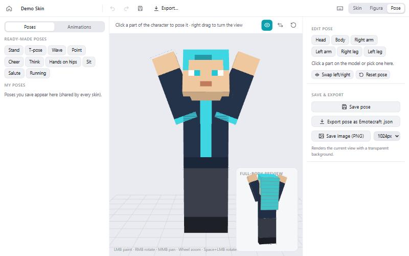
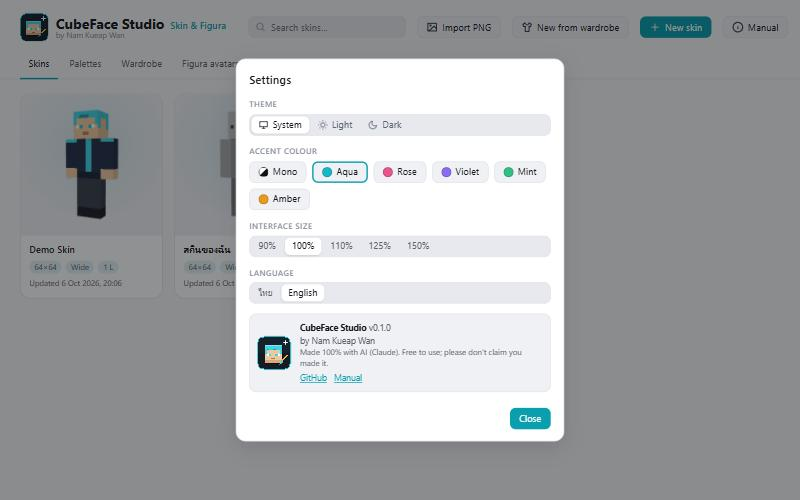

# CubeFace Studio: User manual

**English** · [ภาษาไทย](manual.th.md)

CubeFace Studio is a Minecraft skin editor that also builds **Figura** avatars (smooth head,
hair physics, blinking, expressions, glowing parts, an action wheel). It runs offline on your
computer. This manual walks through every part of the app, with pictures.

> Made 100% with AI (Claude), by Nam Kueap Wan. The app can switch between Thai and English
> at any time: ⚙ Settings → Language.

## Contents

1. [Home screen](#1-home-screen)
2. [The editor](#2-the-editor)
3. [Brushes and painting](#3-brushes-and-painting)
4. [Layers](#4-layers)
5. [Hair planes](#5-hair-planes)
6. [The Figura tab](#6-the-figura-tab)
7. [Face: expressions, blinking, glowing eyes](#7-face-expressions-blinking-glowing-eyes)
8. [Action wheel](#8-action-wheel)
9. [Export](#9-export)
10. [Pose mode](#10-pose-mode)
11. [Libraries: palettes, wardrobe, Figura avatars, emotes](#11-libraries)
12. [Settings](#12-settings)
13. [Keyboard shortcuts](#13-keyboard-shortcuts)
14. [Tips and troubleshooting](#14-tips-and-troubleshooting)

---

## 1. Home screen

Everything starts here.

| Button | What it does |
| --- | --- |
| **New skin** | Start an empty skin. Pick the size (64×64 up to 2048×2048) and the arm type: *Wide (Steve)* or *Slim (Alex)*. |
| **Import PNG** | Open a skin file you already have (a normal Minecraft skin PNG). You can also drag PNG files onto the window. |
| **New from wardrobe** | Build a skin from clothes and parts saved in your wardrobe; every item becomes its own layer. |
| **Manual** | Opens this manual. |
| ⚙ | Settings (theme, colour, interface size, language). |

The tabs under the title open your libraries: **Skins**, **Palettes**, **Wardrobe**,
**Figura avatars** and **Emotes** (see [section 11](#11-libraries)).

Click a skin card to open it. The buttons on a card duplicate or delete the skin (deleted skins go to the recycle bin).

## 2. The editor

The editor has three columns:

- **Left: UV and layers.** The *UV* view shows the flat skin texture; you can paint here too.
  Choose the skin size and the arm type above it. Below are the **Layers** and the
  **Hair planes**.
- **Centre: the 3D model.** Paint directly on the model. Drag with the right mouse button to
  turn it, the middle button to move it, and the mouse wheel to zoom. The small
  **Full-body preview** in the corner shows the whole character.
- **Right: colour and model.** The colour picker, hex code, palettes and recent colours.
  Under **Model** you can hide body parts (base or overlay) to reach the layer underneath.

At the top right, switch between **Skin**, **Figura** and **Pose**. At the top left: back to
Home, undo / redo, save (Ctrl+S) and **Export…**.

## 3. Brushes and painting

The toolbar above the 3D view:

| Tool | Key | Use |
| --- | --- | --- |
| Brush | B | Paint. |
| Eraser | E | Erase. |
| Bucket | G | Fill an area of the same colour. |
| Gradient | U | Drag to blend between two colours. |
| Select | S | Select an area to copy, cut, move or paste (Ctrl+C / Ctrl+X / Ctrl+V). |
| Eyedropper | I (or hold Alt) | Pick a colour. Holding **Alt** picks colours until you let go. |
| Orbit | O (or hold Space) | Turn the model with the left mouse button. |

Brush settings:

- **Size**, **Opacity** and **Softness** (soft edges).
- **Stabilizer**: steadies shaky hands; the line follows a little behind the mouse.
- **Normal / Smooth**: *Smooth* gives soft edges and mixes the new colour with the colours
  already there, so strokes melt together instead of looking like separate blobs.
- **Square / Circle**: the brush shape.
- **Paint on**: *Auto (body first)* paints the inner body layer and only reaches the outer
  layer where the body is hidden; or choose *Base* / *Overlay* yourself.
- **Mirror (M)** paints both sides at once. **Grid (H)** shows texel lines.

A **ring** under the mouse shows exactly where, and how big, the brush will paint (on the
3D model, the UV view and the face paint window).

## 4. Layers

Like a drawing program: each layer is painted separately and they stack from bottom to top.

- **+** adds a layer; Ctrl+D duplicates it; Ctrl+E merges it into the layer below.
- 👁 shows or hides a layer, 🔒 locks it, the slider sets its opacity.
- ☀ **Glows in the dark (Figura)**: pixels on this layer glow in game. Paint the parts that
  should glow (lights, patterns, eyes) on their own layer and switch this on.
- Drag PNG files onto the window to add them as layers.

## 5. Hair planes

Hair planes are flat pieces of hair that hang from the head and swing with physics in Figura.

1. In the **Skin** tab, scroll the right panel down to **Hair planes**.
2. Choose **Front** or **Back** and a length (**Short / Medium / Long**), then
   **Add hair plane**.
3. Paint the plane: select it (in the list or by clicking it on the model) and paint in the UV
   view or directly on the model. The bucket tool fills it quickly.
4. Adjust **Width**, **Height**, **Segments** (more = bends more smoothly), **Offset** and
   **Rotation**, or drag the arrows on the model.
5. **Import picture…** puts your own hair image on the plane.
6. **Physics**: how much the hair swings and hangs. Press **Preview** and pick a motion
   (walk, run, jump…) to test it.
7. ☀ **Glows in the dark (Figura)** makes the plane glow.

## 6. The Figura tab

[Figura](https://figuramc.org) is a Minecraft mod that lets your skin move and do much more.
This tab sets up everything the exported avatar does.

- **Avatar size**: how big the avatar is when uploaded (Figura's limit is 100 KB). The
  number is worked out the same way Figura measures it: pictures, scripts and model data.
  Added Figura avatars are counted too.
- **Skin parts inside the avatar**: *Only what is needed* (smaller; the rest is your normal
  skin) or *Whole skin*.
- **Test motion**: watch the model walk, run, jump, look around or follow the camera.
- **Avatar icon**: the picture next to the avatar name in Figura's wardrobe list
  (`avatar.png`). It is made square for you.
- **Figura used with this skin → Add Figura**: add other avatars from your library (glasses,
  wings, accessories). They show in the preview and are exported with this skin.
- **Head**: *Smooth head* turns the head smoothly (speed and tilt can be set). It also turns
  the head pieces of added avatars, so glasses and hats stay on.
- **Hair physics**, **Blinking** (random time between blinks), **Expressions**.

## 7. Face: expressions, blinking, glowing eyes

In the left column of the Figura tab (**Face setup**):

1. **Drag the boxes** onto the right eye, left eye and mouth of your skin. Drag the small
   square in a box's corner to resize it.
2. **Face image size**: how detailed face frames are. *Same as skin*, or 128 / 256 / 512 /
   1024 (128 = 16×16 px faces, 1024 = 128×128 px). Frames already drawn are rescaled.
3. **Generate face frames**: makes blinking and every expression automatically
   from the boxes. You can repaint any of them.
4. **Face sets…** saves the whole face (every frame, blinking, boxes) to use on another
   skin.
5. **Glowing eyes**: the eyes glow in the dark. **Choose glow spots…** lets you paint which
   spots of the face glow (eyes, marks, anything); **Use eye boxes** goes back to the boxes.

Each frame in the list can be painted: double-click it (or ✏) to open the paint window.

The face paint window has the same tools as the editor (brush, eraser, gradient, eyedropper,
Normal/Smooth, mirror). **Show face under** shows your skin's face faintly underneath.
**Face image size** can be changed here too. Wheel to zoom, right-drag to move; the view
keeps its zoom while you work.

## 8. Action wheel

The action wheel is the menu you open in game (default key **B**) to pick expressions and
switch features. Open it with **Wheel settings…** in the Figura tab.

- **Figura wheel** or **Auria wheel ✨** (animated, with breadcrumbs).
- **Pages**: *Main* opens first. Add pages with **+ Page**, and link to them with a page
  button. **New expressions go here** picks the page that new expressions are added to.
- **Buttons**: expressions, **Normal face**, **switches** (blinking, hair physics, smooth
  head, glow: all / eyes / skin / one hair plane), page buttons and **Home** (jumps
  to the first page, or a page you choose).
- Click a button to change its **title** (English only in game), **icon** (any Minecraft
  item, your own picture, or the face of the expression) and **colour**.
- Switches have **At start: On / Off**: how the switch is when the avatar loads (for example
  glow off until you turn it on).
- **Figura wheel**: each page shows up to 8 slots. *Back* and *Next* are added
  automatically; *Next* only appears when more buttons follow.
- **Auria wheel**: long pages get a *Next* button; right click goes back (a hint says so in
  game). *Close the wheel after picking a face* can be switched off.
- If an added Figura avatar has its own action wheel, a button on your main page opens its
  page (with a *Back* button), instead of it replacing your wheel.

## 9. Export

Click **Export…** at the top. Three kinds:

- **Skin PNG**: the skin file for any launcher or server.
- **Figura avatar**: the avatar for the Figura mod (Java Edition).
  - **Name**, **Author**, **Description** (English letters only).
  - **Script** options, like Figura's own avatar wizard: *Hide Vanilla Armor*, *Hide Vanilla
    Cape*, *Hide Vanilla Elytra*, *Include dummy events* (empty events at the end of
    `script.lua` for your own code).
  - **Save as one .zip file**: one file, ready to share.
  - **Figura to export with it**: added avatars are **merged into one avatar** (default) or
    kept as separate folders. Merging renames clashing files and fixes their scripts, so
    everything keeps working; their creators are credited in `avatar.json`.
- **Bedrock addon**: a `.mcpack` resource pack for Bedrock Edition.

**Where do the files go?** Put the Figura avatar (folder or .zip) into the `figura/avatars`
folder of your Minecraft instance, for example
`.minecraft/figura/avatars/`. In game, open the Figura menu, pick the avatar in the wardrobe
and press upload.

## 10. Pose mode

Switch to **Pose** at the top right.

- **Ready-made poses** (stand, wave, cheer, sit…), or click a body part and turn it.
- **Save pose** keeps it for every skin; **Swap left/right** and **Reset pose** help.
- **Export pose as Emotecraft .json**: use it as an emote with the Emotecraft mod.
- **Save image (PNG)** renders the character with a transparent background (512, 1024 or 2048 px).
- **Animations**: play emotes from your emote library on the model.

## 11. Libraries

From the Home tabs:

- **Palettes**: colour sets. Make one from a picture with the 🖼 button in the editor.
- **Wardrobe**: clothes and parts (PNG in skin layout). Upload items, then use
  **New from wardrobe** or the **Wardrobe** button in the editor to try them on.
- **Figura avatars**: your avatar library. Drag in folders, `.zip` or `.rar` files. Each
  avatar has **rights** (free / bought / own / exclusive; commercial use, redistribution,
  modification), shown before you use or share it.
- **Emotes**: Emotecraft `.json` / `.emotecraft` files with preview and rights; downloading
  is blocked when the rights don't allow sharing.

## 12. Settings

Theme (system / light / dark), accent colour, interface size, language (ไทย / English), and
the app version with links to GitHub and this manual.

## 13. Keyboard shortcuts

Press **F1** in the editor for the full list. Shortcuts work with a Thai keyboard too.

| Keys | Action |
| --- | --- |
| B / E / G / U / S / I / O | Brush / eraser / bucket / gradient / select / eyedropper / orbit |
| Alt (hold) | Eyedropper while held |
| Space (hold) | Turn the model with the left mouse button |
| [ / ] | Smaller / bigger brush (Shift: opacity) |
| M / H | Mirror / grid |
| Ctrl+Z / Ctrl+Y | Undo / redo |
| Ctrl+S | Save |
| Ctrl+Shift+E | Export PNG |
| Ctrl+C / X / V | Copy / cut / paste (selection or layer) |
| Ctrl+D / Ctrl+E | Duplicate layer / merge down |
| Ctrl+Shift+N | New layer |
| Ctrl+1 / Ctrl+2 | Skin tab / Figura tab |
| Delete | Delete the selection (or the layer) |
| Esc | Clear the selection / leave hair or face editing |

## 14. Tips and troubleshooting

- **The avatar is over 100 KB.** Use *Only what is needed*, a smaller face image size, fewer
  or smaller hair planes, or fewer added avatars. The size meter shows what takes the space.
- **Something in game isn't there.** Buttons whose feature is switched off are left out of
  the wheel (the wheel window shows why, next to each button).
- **Glow doesn't show.** Glow needs Figura's emissive rendering; check the glow switches in
  the wheel (and their *At start* setting).
- **Merged avatars.** The owner's script runs first. If an added avatar does something
  unusual with its wheel, export it as a separate folder instead.
- **Your data** is stored in `%APPDATA%\nkw-skin-figura` (skins, libraries). Back up this
  folder to keep everything.
- Found a bug? Open an issue on
  [GitHub](https://github.com/Maskbuild/CubeFace-Studio/issues).
