
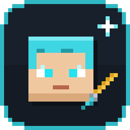

# CubeFace Studio: คู่มือการใช้งาน

[English](manual.en.md) · **ภาษาไทย**

CubeFace Studio คือโปรแกรมวาดสกิน Minecraft ที่สร้าง avatar ของ **Figura** ได้ด้วย (หัวสมูท
ผมมีฟิสิกส์ กระพริบตา สีหน้า ส่วนที่เรืองแสง และวงล้อ action) ใช้งานแบบออฟไลน์บนเครื่อง
คู่มือนี้อธิบายทุกส่วนของโปรแกรมพร้อมภาพประกอบ

> สร้างด้วย AI (Claude) 100% โดย Nam Kueap Wan · เปลี่ยนภาษาไทย/อังกฤษได้ตลอด ที่ ⚙ ตั้งค่า → ภาษา

## สารบัญ

1. [หน้าแรก](#1-หน้าแรก)
2. [หน้าแก้ไขสกิน](#2-หน้าแก้ไขสกิน)
3. [แปรงและการวาด](#3-แปรงและการวาด)
4. [เลเยอร์](#4-เลเยอร์)
5. [แผ่นผม](#5-แผ่นผม)
6. [แท็บ Figura](#6-แท็บ-figura)
7. [ใบหน้า: สีหน้า กระพริบตา ตาเรืองแสง](#7-ใบหน้า-สีหน้า-กระพริบตา-ตาเรืองแสง)
8. [วงล้อ Action](#8-วงล้อ-action)
9. [ส่งออก (Export)](#9-ส่งออก-export)
10. [โหมดโพส](#10-โหมดโพส)
11. [คลัง: Palette ตู้เสื้อผ้า Figura avatar และ Emote](#11-คลัง)
12. [ตั้งค่า](#12-ตั้งค่า)
13. [ปุ่มลัด](#13-ปุ่มลัด)
14. [เคล็ดลับและการแก้ปัญหา](#14-เคล็ดลับและการแก้ปัญหา)

---

## 1. หน้าแรก

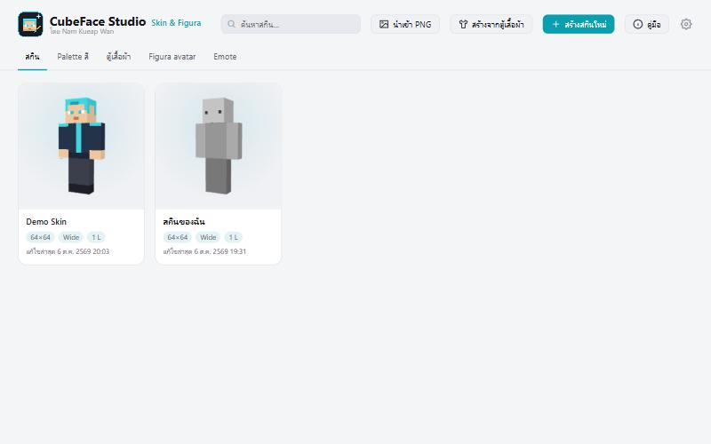

ทุกอย่างเริ่มที่หน้านี้

| ปุ่ม | ใช้ทำอะไร |
| --- | --- |
| **สร้างสกินใหม่** | เริ่มสกินเปล่า เลือกขนาด (64×64 ถึง 2048×2048) และแบบแขน *Wide (Steve)* หรือ *Slim (Alex)* |
| **นำเข้า PNG** | เปิดไฟล์สกินที่มีอยู่แล้ว (ไฟล์ PNG สกิน Minecraft ปกติ) หรือลากไฟล์ PNG มาวางที่หน้าต่างก็ได้ |
| **สร้างจากตู้เสื้อผ้า** | ประกอบสกินจากเสื้อผ้าและชิ้นส่วนในตู้เสื้อผ้า ทุกชิ้นจะแยกเป็นเลเยอร์ของตัวเอง |
| **คู่มือ** | เปิดคู่มือนี้ |
| ⚙ | ตั้งค่า (ธีม สีเน้น ขนาดหน้าจอ ภาษา) |

แท็บใต้ชื่อโปรแกรมคือคลังต่างๆ: **สกิน**, **Palette สี**, **ตู้เสื้อผ้า**, **Figura avatar**
และ **Emote** (ดู[หัวข้อ 11](#11-คลัง))

คลิกการ์ดสกินเพื่อเปิด ปุ่มบนการ์ดใช้ทำสำเนาหรือลบสกิน (สกินที่ลบจะไปอยู่ในถังขยะของเครื่อง)

## 2. หน้าแก้ไขสกิน

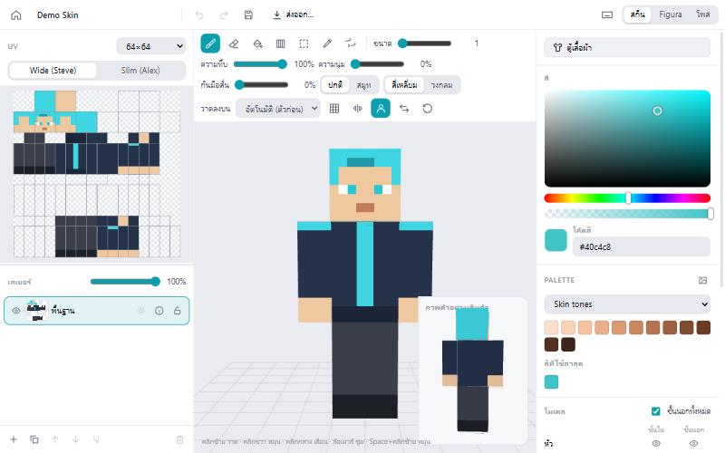

หน้าแก้ไขแบ่งเป็น 3 ส่วน

- **ซ้าย: UV และเลเยอร์** หน้า *UV* แสดงภาพสกินแบบแบน วาดตรงนี้ได้เหมือนกัน ด้านบนเลือกขนาด
  สกินและแบบแขน ด้านล่างคือ **เลเยอร์** และ **แผ่นผม**
- **กลาง: โมเดล 3D** วาดลงบนตัวโมเดลได้เลย คลิกขวาลากเพื่อหมุน คลิกกลางลากเพื่อเลื่อน
  ล้อเมาส์เพื่อซูม **ภาพตัวอย่างเต็มตัว** ที่มุมจอแสดงตัวละครทั้งตัว
- **ขวา: สีและโมเดล** ตัวเลือกสี โค้ดสี Palette และสีที่ใช้ล่าสุด หัวข้อ **โมเดล**
  ใช้ซ่อนส่วนของร่างกาย (ชั้นในหรือชั้นนอก) เพื่อวาดชั้นที่อยู่ข้างใต้

มุมขวาบนสลับ **สกิน**, **Figura** และ **โพส** มุมซ้ายบนมีปุ่มกลับหน้าแรก ย้อนกลับ/ทำซ้ำ
บันทึก (Ctrl+S) และ **ส่งออก…**

## 3. แปรงและการวาด

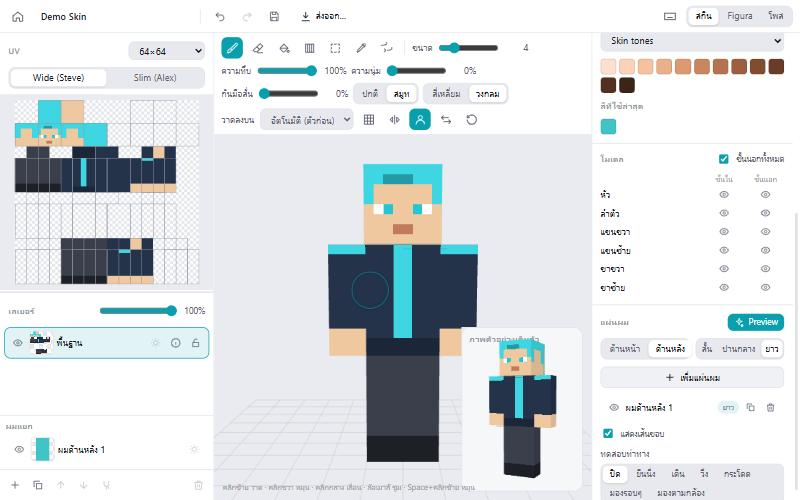

แถบเครื่องมือเหนือโมเดล 3D

| เครื่องมือ | ปุ่ม | ใช้ทำอะไร |
| --- | --- | --- |
| แปรง | B | วาด |
| ยางลบ | E | ลบ |
| ถังสี | G | เทสีพื้นที่ที่เป็นสีเดียวกัน |
| ไล่สี | U | ลากเพื่อไล่สีระหว่างสองสี |
| เลือกพื้นที่ | S | เลือกพื้นที่เพื่อคัดลอก ตัด ย้าย หรือวาง (Ctrl+C / Ctrl+X / Ctrl+V) |
| ดูดสี | I (หรือกด Alt ค้าง) | ดูดสีจากภาพ กด **Alt** ค้างไว้เพื่อดูดสีชั่วคราว ปล่อยแล้วกลับเป็นเครื่องมือเดิม |
| หมุนมุมมอง | O (หรือกด Space ค้าง) | หมุนโมเดลด้วยคลิกซ้าย |

ตั้งค่าแปรง

- **ขนาด**, **ความทึบ**, **ความนุ่ม** (ขอบแปรงนุ่ม)
- **กันมือสั่น**: ช่วยให้เส้นนิ่ง เส้นจะตามเมาส์ช้าลงนิดหน่อย
- **ปกติ / สมูท**: แบบ *สมูท* ขอบนุ่มและสีที่ลงจะผสมกับสีเดิมรอบๆ ลงแล้วสีกลืนกัน ไม่แยกเป็นก้อน
- **สี่เหลี่ยม / วงกลม**: รูปทรงหัวแปรง
- **วาดลงบน**: *อัตโนมัติ (ตัวก่อน)* วาดชั้นในของตัวก่อน และวาดชั้นนอกเฉพาะตรงที่ซ่อนตัวไว้
  หรือเลือก *ชั้นใน* / *ชั้นนอก* เอง
- **Mirror (M)** วาดสองข้างพร้อมกัน **Grid (H)** แสดงเส้นตาราง

**วงกลมใต้เมาส์** บอกตำแหน่งและขนาดที่แปรงจะวาด (บนโมเดล 3D หน้า UV และหน้าต่างวาดหน้า)

## 4. เลเยอร์

เหมือนโปรแกรมวาดภาพทั่วไป แต่ละเลเยอร์วาดแยกกันและซ้อนจากล่างขึ้นบน

- **+** เพิ่มเลเยอร์ · Ctrl+D ทำสำเนา · Ctrl+E รวมกับเลเยอร์ด้านล่าง
- 👁 แสดง/ซ่อน · 🔒 ล็อก · แถบเลื่อนปรับความทึบ
- ☀ **เรืองแสงในที่มืด (Figura)**: พิกเซลในเลเยอร์นี้จะเรืองแสงในเกม แนะนำให้วาดส่วนที่อยาก
  ให้เรืองแสง (ไฟ ลวดลาย ดวงตา) แยกไว้ในเลเยอร์ของตัวเองแล้วเปิดปุ่มนี้
- ลากไฟล์ PNG มาวางเพื่อเพิ่มเป็นเลเยอร์ใหม่ได้

## 5. แผ่นผม

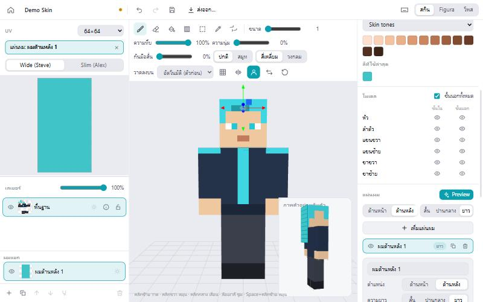

แผ่นผมคือผมแผ่นแบนที่ห้อยจากหัว และแกว่งตามฟิสิกส์ใน Figura

1. ที่แท็บ **สกิน** เลื่อนแผงด้านขวาลงมาที่ **แผ่นผม**
2. เลือก **ด้านหน้า** หรือ **ด้านหลัง** และความยาว (**สั้น / ปานกลาง / ยาว**) แล้วกด
   **เพิ่มแผ่นผม**
3. วาดลายผม: เลือกแผ่นผม (จากรายการ หรือคลิกที่ผมบนโมเดล) แล้ววาดในหน้า UV หรือบนโมเดล
   ใช้ถังสีเทสีทั้งแผ่นได้เร็ว
4. ปรับ **กว้าง** **ยาว** **จำนวนข้อ** (ยิ่งมากยิ่งโค้งนุ่ม) **ตำแหน่ง** และ **การหมุน**
   หรือลากลูกศรบนโมเดล
5. **นำเข้าภาพ…** ใส่รูปผมของตัวเอง
6. **ฟิสิกส์**: ปรับการแกว่งและการห้อย กด **Preview** แล้วเลือกท่า (เดิน วิ่ง กระโดด…) เพื่อทดสอบ
7. ☀ **เรืองแสงในที่มืด (Figura)** ทำให้ผมแผ่นนั้นเรืองแสง

## 6. แท็บ Figura

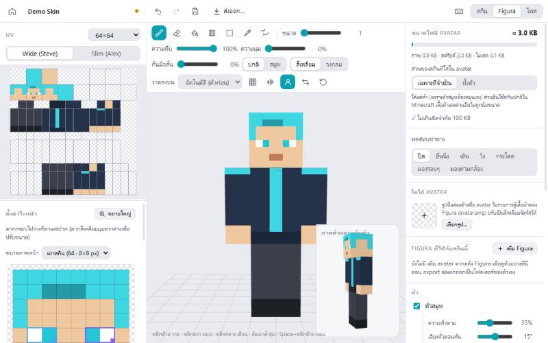

[Figura](https://figuramc.org) เป็นม็อด Minecraft ที่ทำให้สกินขยับและทำอะไรได้อีกมาก
แท็บนี้ตั้งค่าทุกอย่างของ avatar ที่ส่งออก

- **ขนาดไฟล์ avatar**: ขนาดตอนอัปโหลด (Figura จำกัด 100 KB) คำนวณแบบเดียวกับที่ Figura วัด
  (ภาพ สคริปต์ และข้อมูลโมเดล) รวม Figura ที่เพิ่มเข้ามาด้วย
- **ส่วนของสกินที่ใส่ใน avatar**: *เฉพาะที่จำเป็น* (ไฟล์เล็ก ส่วนที่เหลือใช้สกินปกติ) หรือ *ทั้งตัว*
- **ทดสอบท่าทาง**: ดูโมเดลเดิน วิ่ง กระโดด มองรอบๆ หรือมองตามกล้อง
- **โลโก้ avatar**: รูปที่แสดงข้างชื่อ avatar ในรายการตู้เสื้อผ้าของ Figura (`avatar.png`)
  ปรับเป็นสี่เหลี่ยมจัตุรัสให้
- **Figura ที่ใช้กับสกินนี้ → เพิ่ม Figura**: เพิ่ม avatar อื่นจากคลัง (แว่น ปีก เครื่องประดับ)
  แสดงในหน้าตัวอย่างและส่งออกไปพร้อมกับสกินนี้
- **หัว**: *หัวสมูท* หันหัวแบบนุ่มนวล (ปรับความเร็วและการเอียงได้) และหมุนชิ้นที่ติดหัวของ
  avatar ที่เพิ่มเข้ามาด้วย แว่นหรือหมวกจึงไม่หลุดจากหัว
- **ฟิสิกส์ผม**, **กระพริบตา** (สุ่มเวลาระหว่างการกระพริบ), **สีหน้า**

## 7. ใบหน้า: สีหน้า กระพริบตา ตาเรืองแสง

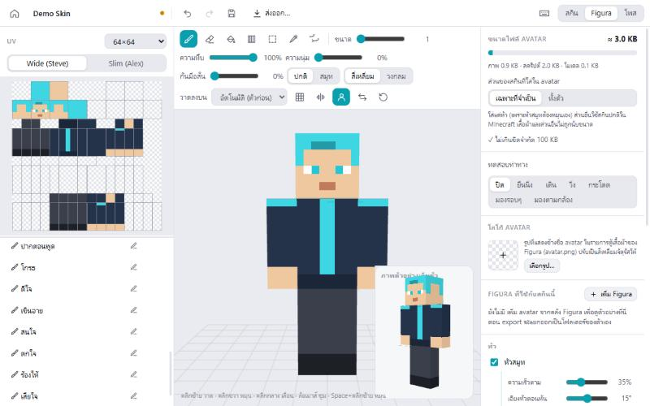

คอลัมน์ซ้ายของแท็บ Figura (**ตั้งค่าใบหน้า**)

1. **ลากกรอบ** ไปวางที่ตาขวา ตาซ้าย และปากของสกิน ลากสี่เหลี่ยมเล็กที่มุมกรอบเพื่อปรับขนาด
2. **ขนาดภาพหน้า**: ความละเอียดของเฟรมหน้า *เท่าสกิน* หรือ 128 / 256 / 512 / 1024
   (128 = หน้า 16×16 px, 1024 = 128×128 px) เปลี่ยนแล้วภาพที่วาดไว้จะย่อ/ขยายตาม
3. **สร้างเฟรมหน้าอัตโนมัติ**: สร้างภาพกระพริบตา และทุกสีหน้าจากกรอบให้อัตโนมัติ
   แล้ววาดแก้ทีหลังได้
4. **ชุดหน้าตา…** บันทึกหน้าตาทั้งชุด (ทุกเฟรม กระพริบ กรอบ) ไว้ใช้กับสกินอื่น
5. **ตาเรืองแสง**: ตาเรืองแสงในที่มืด กด **เลือกจุดเรืองแสง…** เพื่อระบายเองว่าจุดไหนบนหน้า
   เรืองแสง (ตา ลาย หรืออะไรก็ได้) ปุ่ม **ใช้กรอบตา** กลับไปใช้กรอบตาเหมือนเดิม

ทุกเฟรมในรายการวาดได้ ดับเบิลคลิก (หรือกด ✏) เพื่อเปิดหน้าต่างวาดหน้า

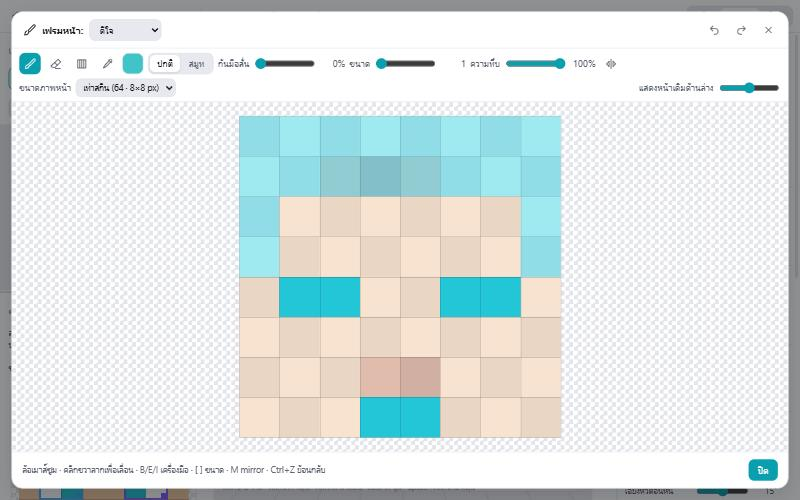

หน้าต่างวาดหน้ามีเครื่องมือเหมือนหน้าหลัก (แปรง ยางลบ ไล่สี ดูดสี ปกติ/สมูท mirror)
**แสดงหน้าเดิมด้านล่าง** แสดงหน้าของสกินจางๆ ไว้ข้างใต้ เปลี่ยน **ขนาดภาพหน้า** ได้ในหน้าต่างนี้ด้วย
ล้อเมาส์ซูม คลิกขวาลากเพื่อเลื่อน และระยะซูมจะคงเดิมระหว่างวาด

## 8. วงล้อ Action

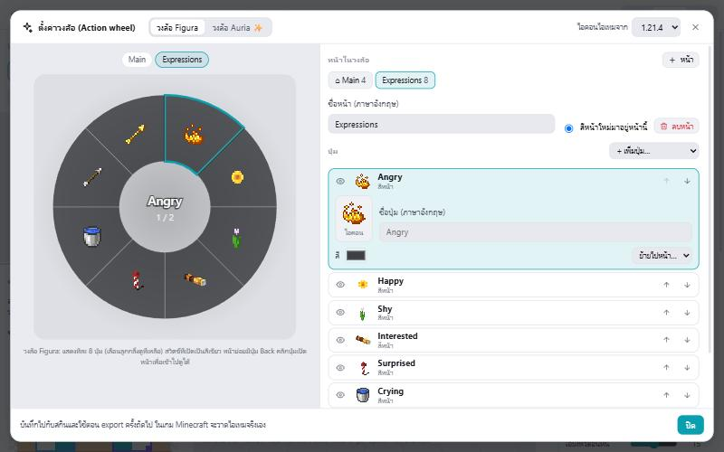

วงล้อ action คือเมนูที่เปิดในเกม (ปุ่มเริ่มต้นคือ **B**) ไว้เลือกสีหน้าและเปิด/ปิดความสามารถต่างๆ
เปิดได้จากปุ่ม **ตั้งค่าวงล้อ…** ในแท็บ Figura

- **วงล้อ Figura** หรือ **วงล้อ Auria ✨** (มีแอนิเมชันและแถบบอกตำแหน่งหน้า)
- **หน้า**: หน้า *Main* เปิดก่อนเสมอ เพิ่มหน้าด้วย **+ หน้า** แล้วใส่ปุ่มไปหน้านั้น
  **สีหน้าใหม่มาอยู่หน้านี้** เลือกหน้าที่สีหน้าใหม่จะถูกเพิ่มเข้าไป
- **ปุ่ม**: สีหน้า, **กลับหน้าปกติ**, **สวิตช์** (กระพริบตา ฟิสิกส์ผม หัวสมูท เรืองแสง:
  ทั้งหมด / ตา / สกิน / ผมแต่ละแผ่น), ปุ่มเปิดหน้า และ **กลับหน้าแรก** (ไปหน้าแรก หรือหน้าที่เลือกเอง)
- คลิกที่ปุ่มเพื่อแก้ **ชื่อ** (ในเกมใช้ภาษาอังกฤษเท่านั้น) **ไอคอน** (ไอเทม Minecraft รูปของเราเอง
  หรือหน้าของสีหน้านั้น) และ **สี**
- สวิตช์มี **ตอนเริ่ม: เปิด / ปิด** คือสถานะตอนโหลด avatar (เช่นให้เรืองแสงปิดไว้ก่อน แล้วค่อยเปิด)
- **วงล้อ Figura**: หน้าละไม่เกิน 8 ช่อง มีปุ่ม *ย้อนกลับ* และ *ถัดไป* ให้เอง ปุ่มถัดไป
  จะมีเฉพาะเมื่อยังมีปุ่มเหลืออยู่หน้าถัดไป
- **วงล้อ Auria**: หน้าที่ยาวจะมีปุ่ม *ถัดไป* ส่วนการย้อนกลับใช้คลิกขวา (มีข้อความบอกในเกม)
  ตัวเลือก *เลือกหน้าตาแล้วปิดวงล้อ* ปิดได้
- ถ้า Figura ที่เพิ่มเข้ามามีวงล้อของตัวเอง จะมีปุ่มในหน้าแรกของเราไปที่หน้าของมัน (มีปุ่ม *Back*
  กลับมา) แทนที่จะไปทับวงล้อของเรา

## 9. ส่งออก (Export)

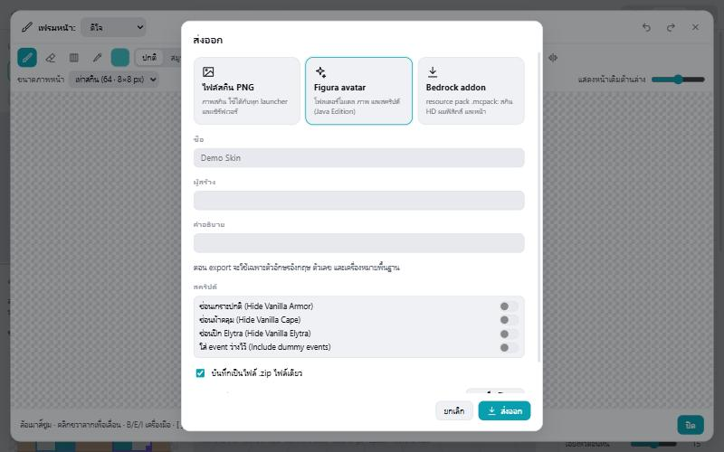

กด **ส่งออก…** ด้านบน มี 3 แบบ

- **ไฟล์สกิน PNG**: ไฟล์สกินใช้กับ launcher หรือเซิร์ฟเวอร์ไหนก็ได้
- **Figura avatar**: avatar สำหรับม็อด Figura (Java Edition)
  - **ชื่อ**, **ผู้สร้าง**, **คำอธิบาย** (ตัวอักษรภาษาอังกฤษเท่านั้น)
  - ตัวเลือก **สคริปต์** เหมือนตัวช่วยสร้าง avatar ของ Figura: *ซ่อนเกราะปกติ*, *ซ่อนผ้าคลุม*,
    *ซ่อนปีก Elytra*, *ใส่ event ว่างไว้* (event ว่างท้าย `script.lua` ไว้เขียนโค้ดเอง)
  - **บันทึกเป็นไฟล์ .zip ไฟล์เดียว**: ไฟล์เดียวพร้อมแชร์
  - **Figura ที่จะส่งออกด้วย**: avatar ที่เพิ่มเข้ามาจะ **รวมเป็นตัวเดียว** (ค่าเริ่มต้น) หรือเลือก
    แยกโฟลเดอร์ก็ได้ ตอนรวม ไฟล์ที่ชื่อซ้ำจะถูกเปลี่ยนชื่อและแก้สคริปต์ให้ ทุกอย่างจึงยังทำงาน
    และใส่เครดิตผู้สร้างไว้ใน `avatar.json`
- **Bedrock addon**: resource pack `.mcpack` สำหรับ Bedrock Edition

**ไฟล์ต้องไปไว้ที่ไหน?** วาง Figura avatar (โฟลเดอร์หรือ .zip) ไว้ในโฟลเดอร์ `figura/avatars`
ของ Minecraft เช่น `.minecraft/figura/avatars/` (Figura เปิด .zip ได้เลยไม่ต้องแตกไฟล์)
ในเกมเปิดเมนู Figura เลือก avatar ในตู้เสื้อผ้า แล้วกดอัปโหลด

## 10. โหมดโพส

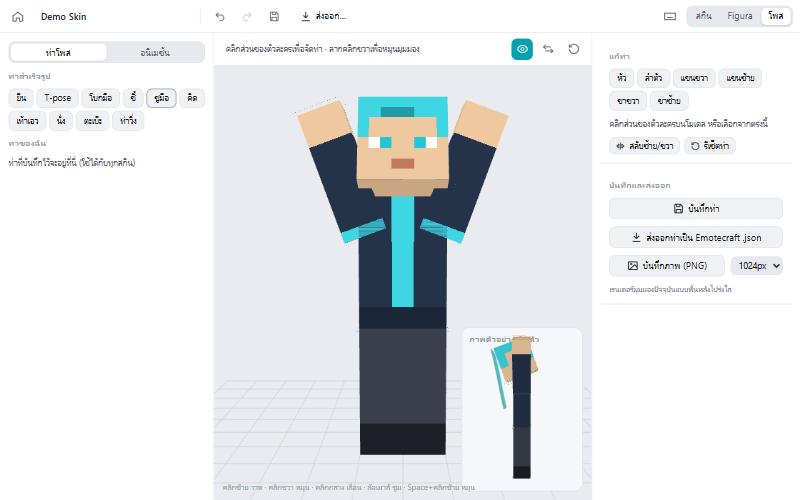

กด **โพส** ที่มุมขวาบน

- **ท่าสำเร็จรูป** (ยืน โบกมือ ชูมือ นั่ง…) หรือคลิกส่วนของร่างกายแล้วหมุนเอง
- **บันทึกท่า** เก็บไว้ใช้กับทุกสกิน มี **สลับซ้าย/ขวา** และ **รีเซ็ตท่า**
- **ส่งออกท่าเป็น Emotecraft .json**: ใช้เป็นท่าทางกับม็อด Emotecraft
- **บันทึกภาพ (PNG)** เรนเดอร์ตัวละครพื้นหลังโปร่งใส (512, 1024 หรือ 2048 px)
- **อนิเมชัน**: เล่นท่าจากคลัง Emote บนโมเดล

## 11. คลัง

จากแท็บในหน้าแรก

- **Palette สี**: ชุดสี สร้างจากรูปภาพได้ด้วยปุ่ม 🖼 ในหน้าแก้ไข
- **ตู้เสื้อผ้า**: เสื้อผ้าและชิ้นส่วน (PNG แบบสกิน) อัปโหลดแล้วใช้ **สร้างจากตู้เสื้อผ้า** หรือปุ่ม
  **ตู้เสื้อผ้า** ในหน้าแก้ไขเพื่อลองใส่
- **Figura avatar**: คลัง avatar ลากโฟลเดอร์ ไฟล์ `.zip` หรือ `.rar` มาวางได้ แต่ละตัวมี **สิทธิ์**
  (ฟรี / ซื้อมา / ของตัวเอง / สิทธิ์ขาด, ใช้เชิงพาณิชย์ แจกต่อ แก้ไข) แสดงก่อนนำไปใช้หรือแชร์
- **Emote**: ไฟล์ Emotecraft `.json` / `.emotecraft` มีภาพตัวอย่างและสิทธิ์ ถ้าสิทธิ์ไม่อนุญาต
  ให้แจกต่อจะดาวน์โหลดไม่ได้

## 12. ตั้งค่า

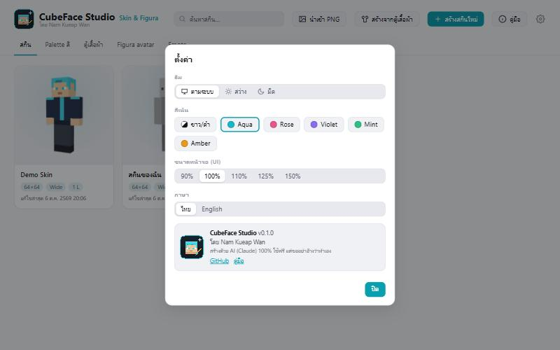

ธีม (ตามระบบ / สว่าง / มืด), สีเน้น, ขนาดหน้าจอ, ภาษา (ไทย / English) และเวอร์ชันของโปรแกรม
พร้อมลิงก์ไป GitHub และคู่มือนี้

## 13. ปุ่มลัด

กด **F1** ในหน้าแก้ไขเพื่อดูทั้งหมด ปุ่มลัดใช้ได้แม้แป้นพิมพ์เป็นภาษาไทย

| ปุ่ม | ทำอะไร |
| --- | --- |
| B / E / G / U / S / I / O | แปรง / ยางลบ / ถังสี / ไล่สี / เลือกพื้นที่ / ดูดสี / หมุนมุมมอง |
| Alt (กดค้าง) | ดูดสีระหว่างที่กดค้าง |
| Space (กดค้าง) | หมุนโมเดลด้วยคลิกซ้าย |
| [ / ] | แปรงเล็กลง / ใหญ่ขึ้น (กด Shift: ความทึบ) |
| M / H | Mirror / เส้นตาราง |
| Ctrl+Z / Ctrl+Y | ย้อนกลับ / ทำซ้ำ |
| Ctrl+S | บันทึก |
| Ctrl+Shift+E | ส่งออก PNG |
| Ctrl+C / X / V | คัดลอก / ตัด / วาง (พื้นที่ที่เลือก หรือเลเยอร์) |
| Ctrl+D / Ctrl+E | ทำสำเนาเลเยอร์ / รวมกับเลเยอร์ล่าง |
| Ctrl+Shift+N | เลเยอร์ใหม่ |
| Ctrl+1 / Ctrl+2 | แท็บสกิน / แท็บ Figura |
| Delete | ลบพื้นที่ที่เลือก (หรือลบเลเยอร์) |
| Esc | ยกเลิกการเลือก / ออกจากการแก้ผมหรือหน้า |

## 14. เคล็ดลับและการแก้ปัญหา

- **avatar ใหญ่เกิน 100 KB** ใช้ *เฉพาะที่จำเป็น* ลดขนาดภาพหน้า ลดจำนวนหรือขนาดแผ่นผม หรือลด
  Figura ที่เพิ่มเข้ามา ตัวแสดงขนาดบอกได้ว่าส่วนไหนกินพื้นที่
- **บางอย่างไม่มีในเกม** ปุ่มที่ความสามารถถูกปิดอยู่จะไม่ถูกใส่ในวงล้อ (หน้าต่างวงล้อบอกเหตุผล
  ไว้ข้างปุ่มนั้น)
- **ไม่เห็นการเรืองแสง** ตรวจสวิตช์เรืองแสงในวงล้อ และค่า *ตอนเริ่ม* ของสวิตช์นั้น
- **avatar ที่รวมกัน** สคริปต์ของเจ้าของจะรันก่อน ถ้า avatar ที่เพิ่มมาทำงานแปลกๆ กับวงล้อ
  ให้ส่งออกแบบแยกโฟลเดอร์แทน
- **ข้อมูลของคุณ** เก็บอยู่ที่ `%APPDATA%\nkw-skin-figura` (สกินและคลังต่างๆ) สำรองโฟลเดอร์นี้
  ไว้เพื่อเก็บทุกอย่าง
- เจอบั๊ก? แจ้งได้ที่ [GitHub](https://github.com/Maskbuild/CubeFace-Studio/issues)
